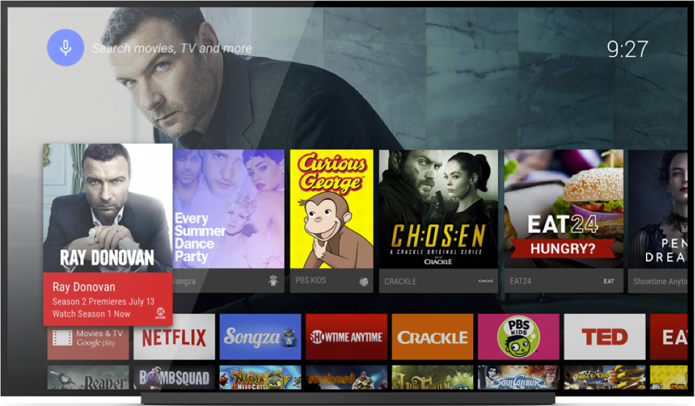
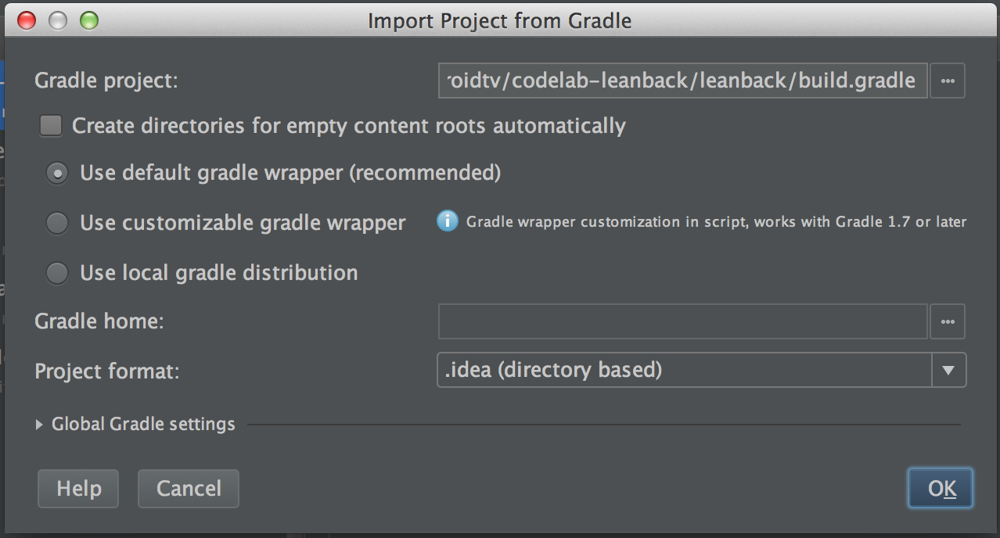
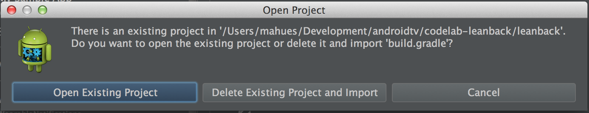
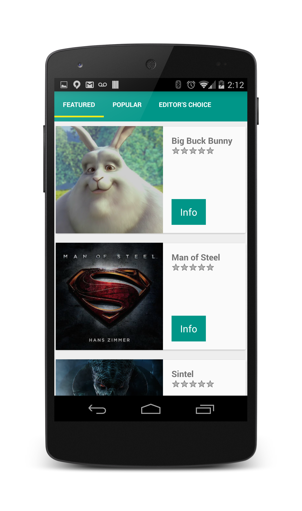
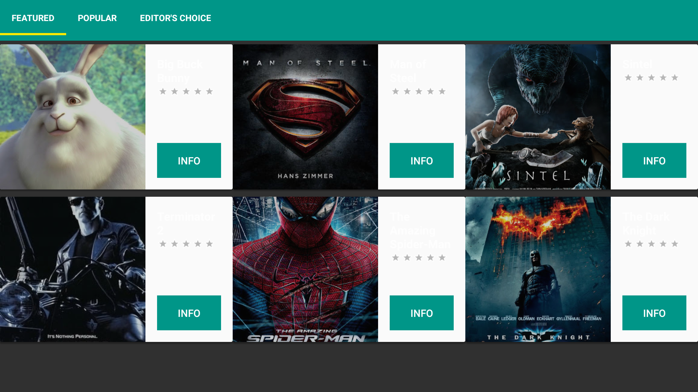

<toc-element></toc-element>

In this codelab, you'll learn how to quickly enable a mobile app for Android TV using the Leanback library.  At the end of the codelab you can expect to have a UX compliant single apk for mobile devices and Android TV.

### Concepts

To start off lets learn a little bit about Android TV.  What is Android TV and how is it different?  At it's core, it is Android so most of the things that you've learned developing your mobile app can be reused.  The key difference is input and the presentation of information.

<figure layout vertical center>
  
</figure>

Android TV is designed for the 10 foot experience.  Instead of a touchscreen, users will be navigating using a controller.  Instead of swiping the notification bar down, the notifications will be displayed as the top row of cards.  And, the screen is always filled with
rich visual content.

In an effort to simplify integration for developers we created the Leanback library.  Leanback has extendable fragments to allow you to quickly and easily create rich animated experiences.  The core fragments we'll be working with are:

* BrowseFragment - Browse through a video library
* DetailsFragment - Display the details of a specific video
* PlaybackOverlayFragment - Control video playback

These fragments use the [Model View Presenter](http://en.wikipedia
.org/wiki/Model%E2%80%93view%E2%80%93presenter) pattern.  You'll bind your data model to the view
using presenter classes.

There's a lot of ground to cover, so let's get started!

### Clone the starter project repo
<aside class="callout">
This codelab uses **Android Studio**, an IDE for developing Android apps.

If you don't have it installed yet, please
[download](https://developer.android.com/sdk/installing/studio.html) and install it.

</aside>

The first thing we need to do is get the mobile app to build on.

    git clone https://github.com/pengying/androidtv-codelab-app.git

Open the project directory and double click on the `build.gradle` file. Open it with Android Studio.

Click OK on "Import Project from Gradle" screen without making any changes.

<figure layout vertical center>
  
</figure>

Click on "Open Existing Project" on the next dialog.

<figure layout vertical center>
  
</figure>

### Understanding the starter project
All right, `checkpoint_0` is the base app that we'll be building upon. 

Each of the following checkpoints can be used as reference points to check your work or for help
if you encounter any issues.  The checkpoint number corresponds with the codelab step - 1.  (0 vs
 1 indexing)

A brief overview of each of the components:

* MainActivity - Video browser
* PlayerActivity - Video player
* SlidingTabLayout, SlidingTabStrip, VideoItemFragment - UI for video browser
* data/
  Video - Object storing video info
* data/
  VideoContentProvider, AbstractVideoItemProvider, VideoItemContract, VideoDataManager - Mock local video database

### Running the starter project
Let's run it on a phone.

<ul>
<li>Connect your Android device or start an emulator.</li>
<li>Select the `checkpoint_0` configuration and click run. </li>
<li>Select your Android device and click ok.</li>

<aside class="callout">
The application stores all its data in a ContentProvider backed up by a SQLite database.  If you want to learn more about querying databases take a look at our [documentation](http://developer.android.com/training/basics/data-storage/databases.html).
</aside>

Here's what it should look like.

<figure layout vertical center>
  
</figure>

Now let's see how it looks on Android TV.

### ADB connect to Android TV

First we need to connect to the Android TV device.  In order to that you can use a male to male USB cable or adb connect.  In this codelab we'll cover the adb connect method.

#### On the Android TV

Lets enable developer mode if it's not yet enabled.

<ul>
<li>Open <strong>Settings</strong></li>
<li>Under preferences open <strong>Developer Options</strong></li>
<aside class="callout">
  If `Developer Options` doesn't display go into `Device` -> `About`, scroll down to **Build** and click the build number a few times until you receive the &quot;You're A Developer&quot; toast.  Then exit out of `Settings` and open `Settings` up again.
</aside>
<li>Click <strong>Debugging</strong>.</li>
<li>Change <strong>USB debugging</strong> to On</li>
</ul>

Now we need to find the ip of the device.

<ul>
<li>Back out to the main Settings page and click <strong>Network</strong>.</li>
<li>Select the method that you've connected the device to your intranet.</li>
<li>If you're using Wi-Fi, select the network you're currently connected to.</li>
<li>Click on <strong>Status info</strong> and record your ip.</li>
<li>If you're using ethernet select the Internet connection and record your ip.</li>
</ul>

#### On your development machine

Once you have the ip of the device, you can connect to it using adb connect in a terminal.

    adb connect [ip address]:4321

Sweet, we're now connected!

### Run the app on Android TV

Lets run the app on Android TV.  In Android studio select `checkpoint_0` and click run again.  This time the Android TV device should appear in the list of running devices.  Select it and click ok.

And now the mobile app is running on Android TV.  It could use some TV UI love right?  In the next few steps we'll cover adding some Android TV UI to the existing data sources and video player.

<figure layout vertical center>
  
</figure>

### Summary

In this step you've learned about:

- Android TV and it's concepts
- The codelab `checkpoint_0` base
- How to connect to Android TV devices and deploy APKs

### Next up

Let's start creating the video browsing experience.
