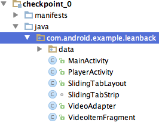
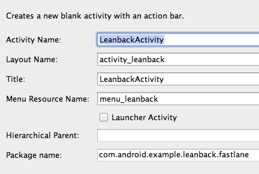
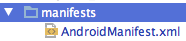
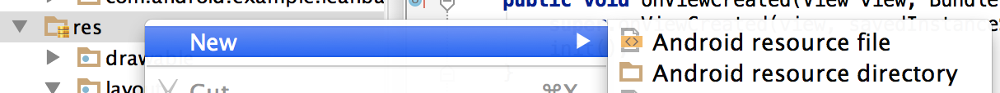
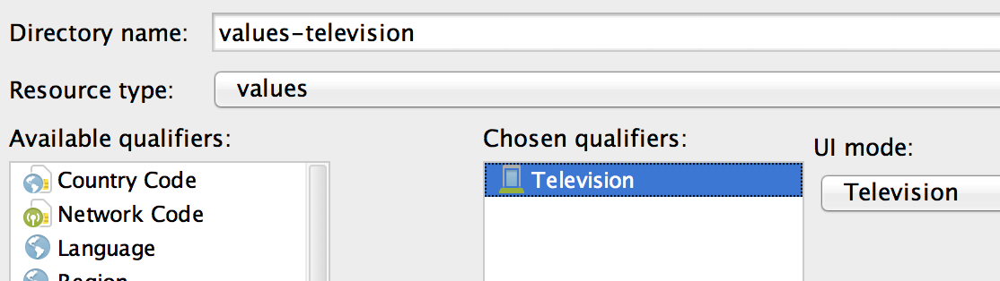
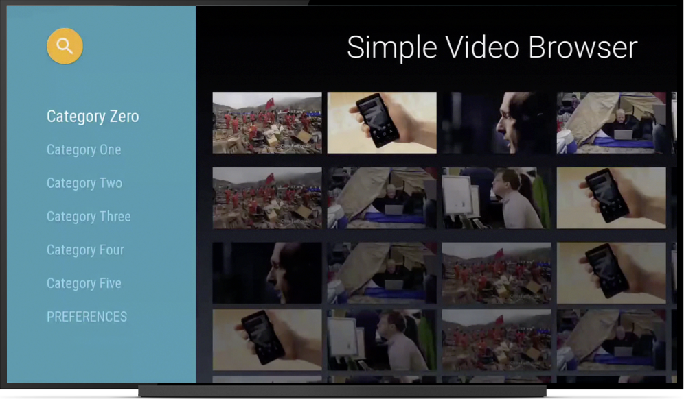

<toc-element></toc-element>

In this step we'll put up the framework for the video browser fragment.  The key concepts to take away in this step are:

- Leanback dependencies
- Android manifest update for Android TV
- Extending the Leanback `BrowseFragment`

Lets get started.

### Add Leanback dependencies

We'll need to add a few dependencies to the build.grade file before we can begin.

Open the `build.grade (checkpoint_0)` file.

Under dependencies add the following

    compile 'com.android.support:leanback-v17:+'
    compile 'com.android.support:recyclerview-v7:+'
    compile 'com.android.support:cardview-v7:21.0.+'

There are a few things to note here as well.  The Leanback libraries target API version 21 are only backwards compatible to API version 17.  For apps that require support for previous versions of Android, you should make sure that the code path utilizing libraries with higher minSdk does not run on devices with version < minSdk(library)

Next, lets take create a browsing activity.

### Create a browsing activity.

In the Android Studio project explorer create a new package under `com.android.example.leanback` called `fastlane`.

Under `fastlane` right click to create a new `Blank Activity` called `LeanbackActivity`, and click on Finish.

Once the class is created, delete the `menu/menu_leanback.xml` resource since it won't be used.  In the `LeanbackActivity` class, delete the `onCreateOptionsMenu` and `onOptionsItemSelected` functions.

### Declare launcher activity for Android TV

Open up `AndroidManifest.xml` 

First, declare that we want to use leanback.  As a child of manifest add the following line:

    <uses-feature android:name="android.software.leanback"
            android:required="false" />

Add an intent filter to the LeanbackActivity tag. `android.intent.category.LEANBACK_LAUNCHER` tells Android TV to launch  `LeanbackActivity` when the application is run.

<pre>
    &lt;activity
        android:name=&quot;.fastlane.LeanbackActivity&quot;
        android:label=&quot;@string/title_activity_player&quot;
        android:theme=&quot;@style/AppTheme&quot; &gt;
        <strong>&lt;intent-filter&gt;
            &lt;action android:name=&quot;android.intent.action.MAIN&quot; /&gt;
            &lt;category android:name=&quot;android.intent.category.LEANBACK_LAUNCHER&quot; /&gt;
        &lt;/intent-filter&gt;</strong>
    &lt;/activity&gt;
 </pre>

We are also adding a theme to the activity. In the next step we will create a values-television directory and create a values specific to television.

<aside class="callout">
<h4>Handling unsupported hardware features</h4>

Since certain features are not available on TV, you need to define their requirement as optional.  If you use any of the following features you'll need to add `android:required="false"` to the definition

<table>
  <tbody><tr>
    <th>Hardware</th>
    <th>Android feature descriptor</th>
  </tr>
  <tr>
    <td>Touchscreen</td>
    <td><code>android.hardware.touchscreen</code></td>
  </tr>
  <tr>
    <td>Telephony</td>
    <td><code>android.hardware.telephony</code></td>
  </tr>
  <tr>
    <td>Camera</td>
    <td><code>android.hardware.camera</code></td>
  </tr>
  <tr>
    <td>Near Field Communications (NFC)</td>
    <td><code>android.hardware.nfc</code></td>
  </tr>
  <tr>
    <td>GPS</td>
    <td><code>android.hardware.location.gps</code></td>
  </tr>
  <tr>
    <td>Microphone</td>
    <td><code>android.hardware.microphone</code></td>
  </tr>
</tbody>
</table>

<pre>
&lt;uses-feature android:name=&quot;android.hardware.touchscreen&quot;
    <strong>android:required=&quot;false&quot;</strong>/&gt;
</pre>
</aside>

### Add an Android TV app banner

In the manifest, add `android:banner` under the application element to define the app banner.  The banner is the app launch point that appears on the home screen in the apps and games rows.

<pre>
&lt;application
    android:allowBackup=&quot;true&quot;
    android:icon=&quot;@drawable/ic_launcher&quot;
    <strong>android:banner=&quot;@drawable/filmi_banner&quot;</strong>
</pre>

### Create resource values for television

We want to create some values that are specifically for Android TV.

&rarr; Right click on the `res` directory and create a new Android resource directory.

&rarr; Create a new values resource directory add `UI mode` and select  `Television` as the qualifier.

&rarr; Right click on the `res` directory and create a new value resource file under the newly
created `values-television`.  Name the resources file styles.xml.

&rarr; Add the following styles which inherit from the `Leanback` theme to customize the look and feel.

    

    

    

    

We've included Leanback libraries, and now Android TV will launch into the correct activity.  Lets create the video browser.

### Create a fragment that extends BrowseFragment

We'll leverage the Leanback [`BrowseFragment`](https://developer.android
.com/reference/android/support/v17/leanback/app/BrowseFragment.html).  The `BrowseFragment` class in the Leanback library allows you to create a primary layout for browsing categories and rows of media
 items with a minimum amount of code.

<figure layout vertical center>
  
</figure>

The first step is to create a class that extends BrowseFragment.

&rarr; Under `fastlane` create a new empty class called `LeanbackBrowseFragment` that extends `BrowseFragment`.

Next lets fill out the class a little bit

&rarr; To the class, add a private member ArrayObjectAdapter.  We'll get into details about ArrayObjectAdapter in the next step.

    private ArrayObjectAdapter mRowsAdapter;

&rarr; We'll also add a helper function to initialize the fragment.  In it we instantiate `mRowsAdapter`, set it as the Adapter for the fragment then set our main color and badge which appears in the top right of the browse view.

    public void init() {
        mRowsAdapter = new ArrayObjectAdapter();
        setAdapter(mRowsAdapter);

        setBrandColor(getResources().getColor(R.color.primary));
        setBadgeDrawable(getResources().getDrawable(R.drawable.filmi));
    }

&rarr; Override the `onViewCreated` method and call `init`.

    @Override
    public void onViewCreated(View view, Bundle savedInstanceState) {
        super.onViewCreated(view, savedInstanceState);
        init();
    }

All right onto the final step of this section, adding this fragment to the activity.

### Add fragment to activity

Open up `activity_leanback.xml` under `layouts` and delete everything.  The only thing we'll display in this activity is our `LeanbackBrowseFragment` fragment.  So add the following:

    <FrameLayout xmlns:android="http://schemas.android.com/apk/res/android"
        android:id="@+id/main_frame"
        android:layout_width="match_parent"
        android:layout_height="match_parent">

        <fragment
            android:name="com.android.example.leanback.fastlane.LeanbackBrowseFragment"
            android:id="@+id/browse_fragment"
            android:layout_width="match_parent"
            android:layout_height="match_parent" />

    </FrameLayout>

Congrats! The framework for the browse fragment is in place.

### Summary

In this step you've learned about:

- Declaring dependencies
- Updating the Android manifest
- Extending the `BrowseFragment`

### Next up

Lets finish the browse fragment.