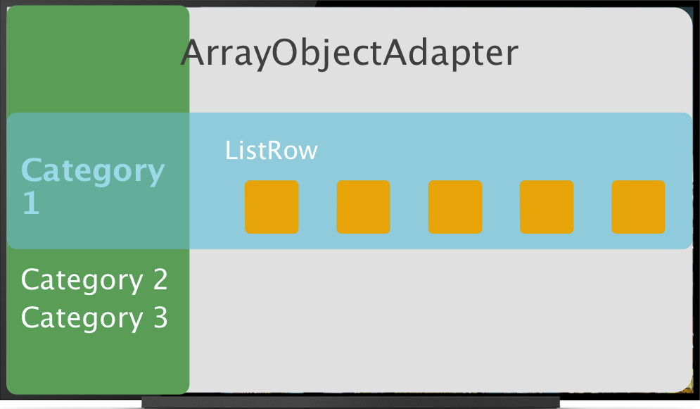
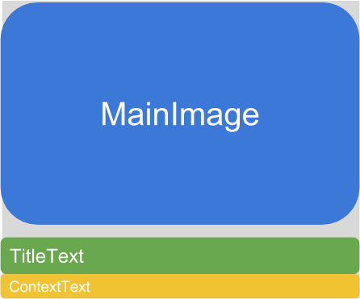
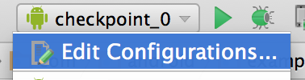
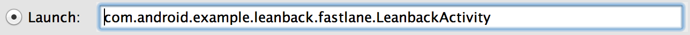

<toc-element></toc-element>

In this step we'll learn about how the Leanback `BrowseFragment` works and put some content into it.

Let's get started.

### Concepts
First, let's cover how the `BrowseFragment` works.  The `BrowseFragment` basically renders rows of data that you provide.

<figure layout vertical center>
  
</figure>

Think of each row as two pieces, a [`HeaderItem`](https://developer.android.com/reference/android/support/v17/leanback/widget/HeaderItem.html) which defines the category and an array of objects represented by the [`ListRow`](https://developer.android.com/reference/android/support/v17/leanback/widget/ListRow.html) class which defines the content.

The ArrayObjectAdapter is an array of the defined `ListRows` that aggregates the rows for the `BrowseFragment` view.

We can store any sort of View in ListRows, but in our app we'll use the Leanback [`ImageCardView`](https://developer.android.com/reference/android/support/v17/leanback/widget/ImageCardView.html).  The zoom and additional detail affects are automatically handled by the Leanback library.

To tie your video data and the `ImageCardView` together, we use a `Presenter`.  The `Presenter` defines which elements of the view are populated from which elements of the model.

Lastly we have the [`ViewHolder`](https://developer.android.com/reference/android/support/v17/leanback/widget/Presenter.ViewHolder.html)  which is a container for the created view.

Let's put all of these concepts together to create the video browsing experience.

### Create a presenter

We need to create a presenter to tie our `Video` model to the `ImageCardView`.

&rarr; Under `fastlane` create a new class called CardPresenter and extend Presenter.

&rarr; Define class variables to store the desired `ImageCardView` height and width and the application context.

    private static int CARD_WIDTH = 200;
    private static int CARD_HEIGHT = 200;

    private static Context mContext;

&rarr; Implement the abstract methods `onCreateViewHolder`, `onBindViewHolder`, and `onUnbindViewHolder`.

    @Override
    public ViewHolder onCreateViewHolder(ViewGroup viewGroup) {
      return null;
    }
    @Override
    public void onBindViewHolder(Presenter.ViewHolder viewHolder, Object o) {

    }
    @Override
    public void onUnbindViewHolder(Presenter.ViewHolder viewHolder) {

    }

### Create a Picasso Target to handle image loading

We're leveraging [`Picasso`](http://square.github.io/picasso/), an open source library that
simplifies image loading, caching, and resizing.

<aside class="callout">
The base sample app already uses `Picasso` so this should be done for you.  But if you want to add
 it in a separate app, in your build.gradle file add the following dependency.
    <pre>compile 'com.squareup.picasso:picasso:2.3.4'</pre>
</aside>

&rarr; Create an inner static class `PicassoImageCardViewTarget` implementing `com.squareup.picasso.Target` and implement the methods: `onBitmapLoaded`, `onBitmapFailed` and `onPrepareLoad`.

    static class PicassoImageCardViewTarget implements Target {

      @Override
      public void onBitmapLoaded(Bitmap bitmap, Picasso.LoadedFrom from) {

      }

      @Override
      public void onBitmapFailed(Drawable errorDrawable) {

      }

      @Override
      public void onPrepareLoad(Drawable placeHolderDrawable) {

      }
    }

&rarr; To this class we'll add a variable to store the `ImageCardView` we'll draw into once the
bitmap is loaded.

    private ImageCardView mImageCardView;

&rarr; Create a constructor with the target `ImageCardView` as the parameter and store it as the instances `mImageCardView`.

    public PicassoImageCardViewTarget(ImageCardView mImageCardView) {
        this.mImageCardView = mImageCardView;
    }

&rarr; In `onBitmapLoaded`, we create a new `Drawable` from the bitmap and set it as the main image for the ImageCardView.

    Drawable bitmapDrawable = new BitmapDrawable(mContext.getResources(), bitmap);
    mImageCardView.setMainImage(bitmapDrawable);

&rarr; In `onBitmapFailed`, we set the ImageCardView image to the error default.

    mImageCardView.setMainImage(errorDrawable);

### Create ViewHolder class

We'll use a `ViewHolder` to store all of the data associated with the view.

&rarr; As a child of `CardPresenter`, create an inner static class that extends `Presenter.ViewHolder`
and create the default constructor.

    static class ViewHolder extends Presenter.ViewHolder {

      public ViewHolder(View view) {
        super(view);
      }
    }

&rarr; Define class variables to store the `ImageCardView`, `Drawable`, and `PicassoImageCardViewTarget`.

    private ImageCardView mCardView;
    private Drawable mDefaultCardImage;
    private PicassoImageCardViewTarget mImageCardViewTarget;

&rarr; In the constructor, cast the view parameter as an `ImageCardView` and store it in `mCardView`.  Instantiate a new `PicassoImageCardViewTarget` passing the cardView as the target parameter.  Finally get the default card image from resources.

    public ViewHolder(View view) {
        super(view);
        mCardView = (ImageCardView) view;
        mImageCardViewTarget = new PicassoImageCardViewTarget(mCardView);
        mDefaultCardImage = mContext
            .getResources()
            .getDrawable(R.drawable.filmi);
    }

&rarr; Add a getter for `mCardView`.

    public ImageCardView getCardView() {
        return mCardView;
    }

&rarr; Create a function that loads the image from a String URL.

    protected void updateCardViewImage(String url) {

        Picasso.with(mContext)
                .load(url)
                .resize(CARD_WIDTH * 2, CARD_HEIGHT * 2)
                .centerCrop()
                .error(mDefaultCardImage)
                .into(mImageCardViewTarget);
    }

Now let's create the `ImageCardView` to hold and bind it with some data from the model.

### Create the ImageCardView

`onCreateViewHolder` is called to create a new view. In it we'll handle the logic of storing the
context, and creating a new `ImageCardView`.

    @Override
    public ViewHolder onCreateViewHolder(ViewGroup viewGroup) {

        Log.d("onCreateViewHolder", "creating viewholder");
        mContext = viewGroup.getContext();
        ImageCardView cardView = new ImageCardView(mContext);
        cardView.setFocusable(true);
        cardView.setFocusableInTouchMode(true);
        ((TextView)cardView.findViewById(R.id.content_text)).setTextColor(Color.LTGRAY);
        return new ViewHolder(cardView);
    }

<aside class="callout">
We set the cardView `Focusable` and `FocusableInTouchMode` to true to enable
it to be
selected
when browsing through the rows of content.  It's important to remember to set these fields to
true when implementing Android TV for your app.
</aside>

Finally we set the `TextColor` of the ImageCardView to light gray.

### Bind data to the ViewHolder

We define the data binding logic in `onBindViewHolder`.  We can cast the Object that's being passed in as our `Video` data then set the title text, subtext/content text, and image dimensions.  Finally we tell it to load the image with a thumbnail URL.

    @Override
    public void onBindViewHolder(Presenter.ViewHolder viewHolder, Object o) {
        Video video = (Video) o;
        ((ViewHolder) viewHolder).mCardView.setTitleText(video.getTitle());
        ((ViewHolder) viewHolder).mCardView.setContentText(video.getDescription());
        ((ViewHolder) viewHolder).mCardView.setMainImageDimensions(CARD_WIDTH, CARD_HEIGHT);
        ((ViewHolder) viewHolder).updateCardViewImage(video.getThumbUrl());
    }

Make sure to include the `Video` class:

    import com.android.example.leanback.data.Video;

And our `CardPresenter` is complete.  Lets fill out some `ListRows` with our video content.

### Populate the videos

In the `LeanbackBrowseFragment` let's create some sample categories.  Here we're defining them as constants, but in a real app you would probably pull them from your database.

    private static final String[] HEADERS = new String[]{
        "Featured", "Popular", "Editor's choice"
    };

Now in `init` after we've set the badge drawable we'll loop through the categories and create a row of content for each one.

In each row, we'll create an ObjectAdapter to define how to render the content that well pull from our database.  We'll load the videos, create a header, finally instantiating a `ListRow` with the header and video data and adding it to `mRowsAdapter`.

    public void init() {
        mRowsAdapter = new ArrayObjectAdapter(new ListRowPresenter());
        setAdapter(mRowsAdapter);

        setBrandColor(getResources().getColor(R.color.primary));
        setBadgeDrawable(getResources().getDrawable(R.drawable.filmi));

        for (int position = 0; position < HEADERS.length; position++) {
            ObjectAdapter rowContents = new CursorObjectAdapter((new SinglePresenterSelector(new CardPresenter())));
            VideoDataManager manager = new VideoDataManager(getActivity(),
                    getLoaderManager(),
                    VideoItemContract.VideoItem.buildDirUri(),
                    rowContents);
            manager.startDataLoading();

            HeaderItem headerItem = new HeaderItem(position, HEADERS[position], null);
            mRowsAdapter.add(new ListRow(headerItem, manager.getItemList()));
        }
    }

### Update VideoDataManager to use CursorObjectAdapter

Here, we'll update our VideoDataManager to manage the cursor for our ObjectAdapter.

In `data/VideoDataManager` add an ObjectAdapter to the class `VideoDataManager`.

    private ObjectAdapter mItemList;

Next, add ObjectAdapter as fourth parameter to VideoDataManager
constructor and store the ObjectAdapter as mItemList.

    public VideoDataManager(Context mContext, LoaderManager mLoaderManager, Uri mRowUri, ObjectAdapter rowContents) {
        mItemList = rowContents;
        ....
    }

In `VideoDataManager` set the LOADER_ID to a random integer and replace the video instantiation with
setting the mapper for
`mItemList`.

    LOADER_ID = Double.valueOf(Math.random() * Integer.MAX_VALUE).intValue();
    ((CursorObjectAdapter)mItemList).setMapper(mMapper);

Create the a getter for the ObjectAdapter.

    public ObjectAdapter getItemList() {
        return mItemList;
    }

Update `VideoItemMapper` to extend `CursorMapper`

    public static class VideoItemMapper extends CursorMapper {

Update `onLoadFinished` to set the cursor for `mItemList`.

    public void onLoadFinished(Loader<Cursor> cursorLoader, Cursor cursor) {
        if (mItemList instanceof CursorObjectAdapter) {
            ((CursorObjectAdapter) mItemList).swapCursor(cursor);
        }
    }

Fill in `onLoaderReset` to set the `Cursor` as null

    public void onLoaderReset(Loader<Cursor> cursorLoader) {
        if (mItemList instanceof CursorObjectAdapter) {
            ((CursorObjectAdapter) mItemList).swapCursor(null);
        }
    }

Congrats!  You've completed this step.  Try running the App on Android TV.  You should see a screen similar to the one below.

<aside class="callout">
You can modify the default Activity that's launched from Android Studio.

Click `Edit configuration` 
 
 
Under `Activity` change the radio button to launch `LeanbackActivity`.
 

</aside>

<figure layout vertical center>
  
</figure>

### Summary

In this step you've learned about:

- The `BrowseFragment` and how you can populate it with your videos
- Tying your video data to the view through the MVP pattern

### Next up

Lets create the video details activity.
