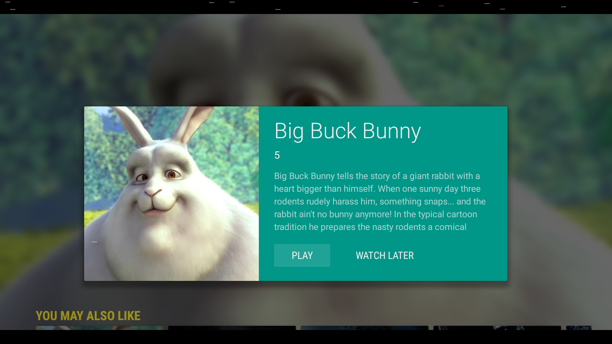

<toc-element></toc-element>

The Leanback library include classes for displaying additional information about a media item, such as a description or reviews, and for taking action on that item, such as purchasing it or playing its content. This lesson discusses how to create a presenter class for media item details, and how to extend the DetailsFragment class to implement a details view for a media item when it is selected by a user.

<figure layout vertical center>
  
</figure>

In this step, you'll learn about:

-   Showing details of a video in a dedicated Activity.
-   Creating an action to play the video to start the video player.
-   Displaying related videos in an row below the detail card.

### DetailsFragment concepts

First let's cover some concepts about how the DetailsFragment works.  It functions very similarly to the BrowseFragment.

<figure layout vertical center>
 
</figure>

The classes controlling `DetailsOverviewRow` and `Additional Row` are defined in a ClassPresenterSelector allowing for flexibility.

The `DetailsOverviewRow` contains the video image, information and available action.  The `Additional Row` can be used to add related content or other controls.

`DetailsOverviewRowPresenter` handles binding the video information to the `DetailsOverviewRow`.

The `Additional Row` can be populated with a ListRow just like the BrowseFragment.

All right, let's create a video detail view.

### Create a new activity VideoDetailsActivity

The first step, create a new Blank Activity to handle the detail fragment.

&rarr; Create an additional `Activity` `VideoDetailsActivity` under `fastlane`.  Name the layout
file
`activity_leanback_details`.

&rarr; Just like when you created the `LeanbackActivity`, you'll need to delete the menu resources
and menu related methods and set it to extend `Activity` instead of `ActionBarActivity`.

&rarr; Under layout, open `activity_leanback_details`.  Replace the default layout with the
following.  Here, we're specifying that the Activity consists of a single fragment
`VideoDetailsFragment`.

<pre>&lt;?xml version=&quot;1.0&quot; encoding=&quot;utf-8&quot;?&gt;
&lt;fragment xmlns:android=&quot;http://schemas.android.com/apk/res/android&quot;
    android:name=&quot;com.android.example.leanback.fastlane.VideoDetailsFragment&quot;
    android:id=&quot;@+id/details_fragment&quot;
    android:layout_width=&quot;match_parent&quot;
    android:layout_height=&quot;match_parent&quot;
/&gt;</pre>

Don't worry about the errors we'll work on creating the Fragment in an upcoming step.

Now that we have the activity framework, let's add the Leanback style to the activity declaration
in the manifest.

### Update Activity theme in the manifest

We need to update the style of this Activity to Leanback.  We can re-use the AppTheme we defined
previous which inherits from Leanback.

<pre>&lt;activity android:name=&quot;.fastlane.VideoDetailsActivity&quot;
    android:label=&quot;@string/title_activity_player&quot;
    <strong>android:theme=&quot;@style/AppTheme&quot;</strong>
    android:exported=&quot;true&quot;&gt;
&lt;/activity&gt;</pre>

Now that the activity is styled correctly.  We need to create the VideoDetailsFragment that we
reference in the layout.

### Create the VideoDetailsFragment framework

Under `fastlane` create a new class called `VideoDetailsFragment` extending [`DetailsFragment`](https://developer.android.com/reference/android/support/v17/leanback/app/DetailsFragment.html).

We'll define a few class variables to store the Video information and some constants for image
sizes and action ids.

    private Video selectedVideo;
    private static final int DETAIL_THUMB_WIDTH = 274;
    private static final int DETAIL_THUMB_HEIGHT = 274;
    private static final int ACTION_PLAY = 1;
    private static final int ACTION_WATCH_LATER = 2;

In `VideoDetailsFragment`, we need to do several things:

* Define the details presenter
* Load the movie thumbnail image
* Create a `DetailsOverviewRow` to display video details
* Create a presenter to bind the video data to the view
* Add a `ListRow` for recommended items
* Handle user actions

Let's start by getting the selected video from the intent.  We'll override `onCreate` and get the
video from the intent.

    @Override
    public void onCreate(Bundle savedInstanceState) {
        super.onCreate(savedInstanceState);
        selectedVideo = (Video) getActivity()
            .getIntent()
            .getSerializableExtra(Video.INTENT_EXTRA_VIDEO);
    }

### Create DetailsDescriptionPresenter

Before we get the image and create the `DetailsOverviewRow` we need to define a Presenter to bind
 the data.  The Leanback framework provides the <a href="https://developer.android
 .com/reference/android/support/v17/leanback/widget/AbstractDetailsDescriptionPresenter.html"><code>AbstractDetailsDescriptionPresenter</code></a> class for this purpose, a nearly complete implementation of the presenter for media item details.

&rarr; Under `fastlane` create a new class `DetailsDescriptionPresenter` extending
`AbstractDetailsDescriptionPresenter`.

&rarr; Override `onBindDescription`.  Cast the item as a `Video` object then get and set the
`Title`,
 `Subtitle` and `Body`.

    @Override
    protected void onBindDescription(ViewHolder viewHolder, Object o) {
        Video video = (Video) o;

        if (video != null) {
            Log.d("Presenter", String.format("%s, %s, %s", video.getTitle(), video.getThumbUrl(), video.getDescription()));
            viewHolder.getTitle().setText(video.getTitle());
            viewHolder.getSubtitle().setText(String.valueOf(video.getRating()));
            viewHolder.getBody().setText(video.getDescription());
        }
    }

### Create AsyncTask to load the image

In order to not block the main UI thread, we create an `AsyncTask` to load the thumbnail
bitmap.  In `VideoDetailsFragment` create a `DetailsRowBuilderTask` class extending AsyncTask
with `Video`, `Integer`, and `DetailsOverviewRow` as the parameter, progress, and result
respectively.

    private class DetailRowBuilderTask extends AsyncTask<Video, Integer, DetailsOverviewRow> {
        @Override
        protected DetailsOverviewRow doInBackground(Video... videos) {
            DetailsOverviewRow row = new DetailsOverviewRow(videos[0]);
            Bitmap poster = null;
            try {
                // the Picasso library helps us dealing with images
                poster = Picasso.with(getActivity())
                        .load(videos[0].getThumbUrl())
                        .resize(dpToPx(DETAIL_THUMB_WIDTH, getActivity().getApplicationContext()),
                                dpToPx(DETAIL_THUMB_HEIGHT, getActivity().getApplicationContext()))
                        .centerCrop()
                        .get();
            } catch (IOException e) {
                e.printStackTrace();
            }
            row.setImageBitmap(getActivity(), poster);
            row.addAction(new Action(ACTION_PLAY, getResources().getString(R.string.action_play)));
            row.addAction(new Action(ACTION_WATCH_LATER, getResources().getString(R.string.action_watch_later)));
            return row;
        }
    }

Here we're instantiating a new [`DetailsOverviewRow`](https://developer.android.com/reference/android/support/v17/leanback/widget/DetailsOverviewRow.html) passing in the current `Video` as the main
item
 for the details page.  We create a
holder `Bitmap` variable to load the thumbnail.  We use Picasso to load and resize the image and
store in poster.

Next we set poster as the bitmap.

Finally, we set the actions of the row.  In this app, we have `ACTION_PLAY` and
`ACTION_WATCH_LATER`, but you could define a purchase or rent action.

In strings.xml define the text for `action_play` and `action_watch_later`.

    <string name="action_play">PLAY</string>
    <string name="action_watch_later">WATCH LATER</string>

To assist in calculating the appropriate screen size in DP, create a utility function.

    public static int dpToPx(int dp, Context ctx) {
        float density = ctx.getResources().getDisplayMetrics().density;
        return Math.round((float) dp * density);
    }

Now that the image has loaded, we can create the rest of the details fragment

### Creating a Presenter when the task has finished executing

The <a href="http://square.github.io/picasso/">Picasso library</a> loads and and resizes the image off the UI thread. After it has completed we create the presenters in the <code>onPostExecute</code> method of the <code>AsyncTask</code> and set the adapter of the <code>DetailsFragment</code>.

&rarr; Override `onPostExecute`.

    @Override
    protected void onPostExecute(DetailsOverviewRow detailRow) {

&rarr; Instantiate a new `ClassPresenterSelector`.  This object allows you to define the presenters
 for each portion of DetailFragment.

    ClassPresenterSelector ps = new ClassPresenterSelector();

&rarr; Instantiate a new `DetailsOverViewRowPresenter` passing in a new Instance of
`DetailsDescriptionPresenter` as a parameter.

     DetailsOverviewRowPresenter dorPresenter = new DetailsOverviewRowPresenter(
         new DetailsDescriptionPresenter());

&rarr; We can add a custom background color programmatically.

     dorPresenter.setBackgroundColor(getResources().getColor(R.color.primary));
     dorPresenter.setStyleLarge(true);

&rarr; Add an onOnActionClickedListener by creating a new OnActionClickedListener and implementing
 onActionClicked.  In onActionClicked, check the actionid.  If the action is `ACTION_PLAY` we
 want to Intent to the VideoPlayer Activity passing the video details.  Otherwise, we'll create a
  toast to display a String defining the action.

     dorPresenter.setOnActionClickedListener(new OnActionClickedListener() {
         @Override
         public void onActionClicked(Action action) {
             if (action.getId() == ACTION_PLAY) {
                 Intent intent = new Intent(getActivity(), PlayerActivity.class);
                 intent.putExtra(Video.INTENT_EXTRA_VIDEO, selectedVideo);
                 startActivity(intent);
             } else {
                 Toast.makeText(getActivity(), action.toString(), Toast.LENGTH_SHORT).show();
             }
         }
     });

&rarr; Add the DetailsOverviewRowPresenter to ClassPresenterSelector.

    ps.addClassPresenter(DetailsOverviewRow.class, dorPresenter);

&rarr; Instantiate a new `ArrayObjectAdapter` passing in the `ClassPresenterSelector`.  Then, add
 the
`DetailRow` to the `ArrayObjectAdapter`.

    ArrayObjectAdapter adapter = new ArrayObjectAdapter(ps);
    adapter.add(detailRow);

&rarr; Finally, set the adapter.

    setAdapter(adapter);

When we're done, the onPostExecute method should look like the following:

    @Override
    protected void onPostExecute(DetailsOverviewRow detailRow) {
        ClassPresenterSelector ps = new ClassPresenterSelector();
        DetailsOverviewRowPresenter dorPresenter = new DetailsOverviewRowPresenter(
        new DetailsDescriptionPresenter());

        // add some style
        dorPresenter.setBackgroundColor(getResources().getColor(R.color.primary));
        dorPresenter.setStyleLarge(true);
        // we listen to two different actions: play and show
        dorPresenter.setOnActionClickedListener(new OnActionClickedListener() {
            @Override
            public void onActionClicked(Action action) {
                if (action.getId() == ACTION_PLAY) {
                    Intent intent = new Intent(getActivity(), PlayerActivity.class);
                    intent.putExtra(Video.INTENT_EXTRA_VIDEO, selectedVideo);
                    startActivity(intent);
                } else {
                    Toast.makeText(getActivity(), action.toString(), Toast.LENGTH_SHORT).show();
                }
            }
        });

        ps.addClassPresenter(DetailsOverviewRow.class, dorPresenter);

        ArrayObjectAdapter adapter = new ArrayObjectAdapter(ps);
        adapter.add(detailRow);
        // finally we set the adapter of the DetailsFragment
        setAdapter(adapter);
    }

### Add a row of related videos below the detail panel

As an additional step, you may add a row of related videos below the detail card. To do this we only have to add another presenter and adapter to the `onPostExecute` method of the `AsyncTask`

First, let's add an additional presenter:

    ps.addClassPresenter(ListRow.class, new ListRowPresenter());

Accordingly, the <code>ArrayObjectAdapter</code> requires an additional `ListRow` to be
added. We create a new `ListRow` to which we pass a `HeaderItem` and a
`CursorObjectAdapter` in the constructor just like we did for the `BrowseFragment`.

    String subcategories[] = {
      "You may also like"
    };

    CursorObjectAdapter rowAdapter = new CursorObjectAdapter(
      new SinglePresenterSelector(new CardPresenter()));
    VideoDataManager manager = new VideoDataManager(getActivity(),getLoaderManager(),
      VideoItemContract.VideoItem.buildDirUri(),rowAdapter);
    manager.startDataLoading();
    HeaderItem header = new HeaderItem(0, subcategories[0], null);
    adapter.add(new ListRow(header, rowAdapter));

### Executing the builder task to build the view

Now we instantiate and execute the `DetailRowBuilderTask` in the `onCreate` method of
the `VideoDetailsFragment`.

    new DetailRowBuilderTask().execute(selectedVideo);

### Create Intent from the browse activity to the details activity

Now that we've completed the `DetailsFragment`, we need to modify the browsing fragment to intent to
the details view when a user clicks on a media item. In order to enable this behavior, add an <a href="https://developer.android.com/reference/android/support/v17/leanback/widget/OnItemViewClickedListener.html"><code>OnItemViewClickedListener</code></a> object to `LeanbackBrowseFragment` that fires an intent to start `VideoDetailsActivity`.

In `init` set the `onItemViewClickedListener`.  Here we're using a helper function to generate
the `onItemViewClickedListener`.

    public class LeanbackBrowseFragment extends BrowseFragment {
    ...
        public void init() {
          ...
          setOnItemViewClickedListener(getDefaultItemViewClickedListener());
          ...
      }
    ...
    }

Create the helper function `getDefaultItemViewClickerListener` which returns a new
`OnItemViewClickedListener`.

    private OnItemViewClickedListener getDefaultItemViewClickedListener() {
      return new OnItemViewClickedListener() {
            @Override
            public void onItemClicked(Presenter.ViewHolder viewHolder, Object o,
          RowPresenter.ViewHolder viewHolder2, Row row) {

          Intent intent = new Intent(getActivity(), VideoDetailsActivity.class);
          intent.putExtra(Video.INTENT_EXTRA_VIDEO, (Serializable)o);
            startActivity(intent);
        }
      };
    }

As we now pass the `Video` object with an `Intent` we use a key `Video.INTENT_EXTRA_VIDEO` for it.

Congrats, you've finished this step! Compile, run and watch how you can play videos now!

<figure layout vertical center>
  
</figure>

### Summary

In this step you've learned about:

- DetailsFragment
- Details row presenters
- How to add a recommendations row

### Next up

Creating recommendations that display on the home screen.
