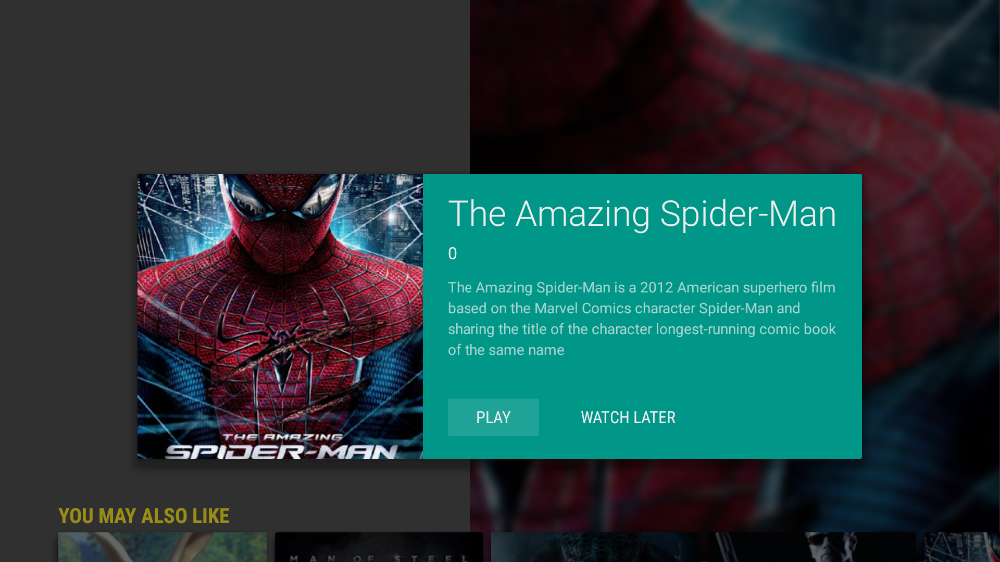

<toc-element></toc-element>

We want to specify the background image as a user browses from item to item in the `BrowseFragment`

<figure layout vertical center>
  
</figure>

The Leanback library support developers in creating immersive TV experiences. This includes using large pictures in the background to improve the experience. In this step you will learn how to use the <a href="https://developer.android.com/reference/android/support/v17/leanback/app/BackgroundManager.html">BackgroundManager</a> to change the background of the user interface according to the selection of the video in the UI. The BackgroundManager supports background image continuity between multiple Activities. It should be noted that the BackgroundManager holds references to potentially large bitmap Drawables. Call <a href="http://developer.android.com/reference/android/support/v17/leanback/app/BackgroundManager.html#release()"><code>release</code></a> to release these references when the Activity is not visible.

###Concepts

- Using the <a href="https://developer.android.com/reference/android/support/v17/leanback/app/BackgroundManager.html">BackgroundManager</a> of the Leanback library.
- Encapsulating background management logic in a single class BackgroundHelper
- Using the <a href="http://square.github.io/picasso/">Picasso library</a> to load and manipulate bitmaps
- Implementing a Picasso <a href="https://square.github.io/picasso/javadoc/com/squareup/picasso/Target.html">Target</a>

### Create BackgroundHelper

Under `fastlane` Create a class <code>BackgroundHelper</code> which we are going to extend step by step to add functionality to change the background image for our TV activities.

	public class BackgroundHelper {
		
	    private static long BACKGROUND_UPDATE_DELAY = 200;
		
	    private final Handler mHandler = new Handler();
		
	    private Activity mActivity;
	    private DisplayMetrics mMetrics;
	    private Timer mBackgroundTimer;
	    private String mBackgroundURL;
		
		
	    private Drawable mDefaultBackground;
	    private Target mBackgroundTarget;
		
	    public BackgroundHelper(Activity mActivity) {
	        this.mActivity = mActivity;
	    }
		
	    public void setBackgroundUrl(String backgroundUrl) {
	        this.mBackgroundURL = backgroundUrl;
	    }
	}

### Add an inner class PicassoBackgroundManagerTarget

The interface <a href="https://square.github.io/picasso/javadoc/com/squareup/picasso/Target.html">Target</a> of the Picasso library acts as a listener for the end of loading and manipulating images which is off the UI thread. We need a custom implementation of the <code>Target</code> set the resulting bitmap as a background image. Note that is important to have a proper implementation of <a href="http://docs.oracle.com/javase/7/docs/api/java/lang/Object.html#hashCode()"><code>hashCode</code></a> and <a href="http://docs.oracle.com/javase/7/docs/api/java/lang/Object.html#equals(java.lang.Object)"><code>equals</code></a> for every <code>Target</code> implementation.

    static class PicassoBackgroundManagerTarget implements Target {
        BackgroundManager mBackgroundManager;
		
        public PicassoBackgroundManagerTarget(BackgroundManager backgroundManager) {
            this.mBackgroundManager = backgroundManager;
        }
		
        @Override
        public void onBitmapLoaded(Bitmap bitmap, Picasso.LoadedFrom loadedFrom) {
            this.mBackgroundManager.setBitmap(bitmap);
        }
		
        @Override
        public void onBitmapFailed(Drawable drawable) {
            this.mBackgroundManager.setDrawable(drawable);
        }
		
        @Override
        public void onPrepareLoad(Drawable drawable) {
            // Do nothing, default_background manager has its own transitions
        }
		
        @Override
        public boolean equals(Object o) {
            if (this == o)
                return true;
            if (o == null || getClass() != o.getClass())
                return false;
				
            PicassoBackgroundManagerTarget that = (PicassoBackgroundManagerTarget) o;
			
            if (!mBackgroundManager.equals(that.mBackgroundManager))
                return false;
				
            return true;
        }
		
        @Override
        public int hashCode() {
            return mBackgroundManager.hashCode();
        }
    }

### Create a method <code>prepareBackgroundManager</code> to instantiate and prepare the <code>PicassoBackgroundManagerTarget</code>

We attach the <a href="http://developer.android.com/reference/android/view/Window.html"><code>Window</code></a> of the current activity to the <code>BackgroundManager</code> and instantiate the <code>PicassoBackgroundManagerTarget</code>. Further a default color is set for the background and at last we get the metrics that describe the size and density of this display.

    public void prepareBackgroundManager() {
        BackgroundManager backgroundManager = BackgroundManager.getInstance(mActivity);
        backgroundManager.attach(mActivity.getWindow());
		
        mBackgroundTarget = new PicassoBackgroundManagerTarget(backgroundManager);
        
		mDefaultBackground = mActivity.getResources().getDrawable(R.drawable.default_background);
		
        mMetrics = new DisplayMetrics();
        mActivity.getWindowManager().getDefaultDisplay().getMetrics(mMetrics);
    }

### Add a method <code>updateBackground</code> to load an image

We are using Picasso to load and manipulate the image. Once done the instance of the <code>PicassoBackgroundManagerTarget</code> is used to apply the loaded image to the UI. The method also makes sure to cancel the timer to make sure only one timer is running.

    protected void updateBackground(String url) {
        Picasso.with(mActivity)
                .load(url)
                .resize(mMetrics.widthPixels, mMetrics.heightPixels)
                .centerCrop()
                .transform(BlurTransform.getInstance(mActivity))
                .error(mDefaultBackground)
                .into(mBackgroundTarget);
				
        if (null != mBackgroundTimer) {
            mBackgroundTimer.cancel();
        }
    }

### Add an inner class <code>UpdateBackgroundTask</code>

This is a subclass of <code>TimerTask</code> to be used to delay updating the background.

    private class UpdateBackgroundTask extends TimerTask {
        @Override
        public void run() {
            mHandler.post(new Runnable() {
                @Override
                public void run() {
                    if (mBackgroundURL != null) {
                        updateBackground(mBackgroundURL);
                    }
                }
            });
        }
    }

### Create the methods <code>startBackgroundTimer</code>

In this method the <code>UpdateBackgroundTask</code> is used to schedule a <code>Timer</code> to update of the background.

    public void startBackgroundTimer() {
        if (null != mBackgroundTimer) {
            mBackgroundTimer.cancel();
        }
        mBackgroundTimer = new Timer();
        mBackgroundTimer.schedule(new UpdateBackgroundTask(), BACKGROUND_UPDATE_DELAY);
    }

### Create the class <code>BlurTransform</code>

This is an implementation of the interface <a href="https://square.github.io/picasso/javadoc/com/squareup/picasso/Transformation.html"><code>com.squareup.picasso.Transformation</code></a> which we use to blur the image to be set as background. We start with auto-generated dummy implementations of the required methods <code>transform</code> and <code>key</code>.

	public class BlurTransform implements Transformation {
	    @Override
	    public Bitmap transform(Bitmap source) {
	        return null;
	    }
		
	    @Override
	    public String key() {
	        return null;
	    }
	}

### Make BlurTransformation a singleton

We want the BlurTransformation to exists only once and make it a <a href="http://en.wikipedia.org/wiki/Singleton_pattern">Sinlgeton</a> and instantiate a <code>RenderScript</code> in the private constructor which takes a <code>Context</code> as single argument.

	RenderScript rs;
	
    static BlurTransform blurTransform;
	
    protected  BlurTransform() {
        // Exists only to defeat instantiation.
    }
	
    private BlurTransform(Context context) {
        super();
        rs = RenderScript.create(context);
    }
	
    public static BlurTransform getInstance(Context context) {
        if (blurTransform == null) {
            blurTransform = new BlurTransform(context);
        }
        return blurTransform;
    }

### Implement the transform and key method

The meat of this class is in the <code>transform</code> method which does the trick of blurring the image.

	  @Override
    public Bitmap transform(Bitmap bitmap) {
        // Create another bitmap that will hold the results of the filter.
        Bitmap blurredBitmap = Bitmap.createBitmap(bitmap);
		
        // Allocate memory for Renderscript to work with
        Allocation input = Allocation.createFromBitmap(rs, bitmap, Allocation.MipmapControl.MIPMAP_FULL, Allocation.USAGE_SHARED);
        Allocation output = Allocation.createTyped(rs, input.getType());
		
        // Load up an instance of the specific script that we want to use.
        ScriptIntrinsicBlur script = ScriptIntrinsicBlur.create(rs, Element.U8_4(rs));
        script.setInput(input);
		
        // Set the blur radius
        script.setRadius(20);
		
        // Start the ScriptIntrinisicBlur
        script.forEach(output);
		
        // Copy the output to the blurred bitmap
        output.copyTo(blurredBitmap);
		
        bitmap.recycle();
		
        return blurredBitmap;
    }
	
    @Override
    public String key() {
        return "blur";
    }

### Apply the transformation

We complete the fluid calls to the Picasso library in the <code>updateBackground</code> method after the <code>centerCrop</code> call. Its pretty simple now.

	.transform(BlurTransform.getInstance(mActivity))

### Add background helper to LeanbackBrowseFragment

These classes are not used anywhere by now. We add it first to the <code>LeanbackBrowseFragment</code>. Add a member variable <code>bgHelper</code>.

    private BackgroundHelper bgHelper;

and instantiate it at the end of the <code>init</code> method of the <code>LeanbackBrowseFragment</code>:

	bgHelper = new BackgroundHelper(getActivity());
    bgHelper.prepareBackgroundManager();
	

The BackgroundHelper should be updated each time the user changes the selects an item view. So we create a factory method <code>getDefaultSelectedListener</code> which does that:

	protected OnItemViewSelectedListener getDefaultItemSelectedListener() {
        return new OnItemViewSelectedListener() {
            public void onItemSelected(Presenter.ViewHolder itemViewHolder, Object item,
                                       RowPresenter.ViewHolder rowViewHolder, Row row) {
                if (item instanceof Video) {
                    bgHelper.setBackgroundUrl(((Video) item).getThumbUrl());
                    bgHelper.startBackgroundTimer();
                }
				
            }
        };
    }

Now we just register the listener in the <code>init</code> method.

	setOnItemViewSelectedListener(getDefaultItemSelectedListener());

### Add background helper to the <code>VideoDetailsFragment</code>

The background should also be set when the details of a video is shown. So we apply this in the <code>VideoDetailsFragment</code> as well. It simpler here because we don't require a listener. It's just added to the <code>onCrreate</code> method of the fragment.

Add the member variable:

	BackgroundHelper bgHelper;
	
and use it in the <code>onCreate</code> method.

	bgHelper = new BackgroundHelper(getActivity());
	bgHelper.prepareBackgroundManager();
	bgHelper.updateBackground(selectedVideo.getThumbUrl());

### Run the app

Congrats, you've completed the codelab!
<aside class="callout">
We have some bonus content on leveraging the
<code>PlaybackOverlayFragment</code> to easily playback controls.  The example for adding a
<code>PlaybackOverlayFragment</code> to an existing player and detecting appropriate playback countrols can be
 found in `checkpoint_6`.
The <code>PlaybackOverlayFragment</code> also allows you to help users find related content in your app without stopping playback.
 
 
If you're looking for sample code for additional features, checkout our <a href="https://github
.com/googlesamples/androidtv-Leanback">full sample</a>.  It includes sample code for the search
fragment, grid fragment and others.
</aside>
